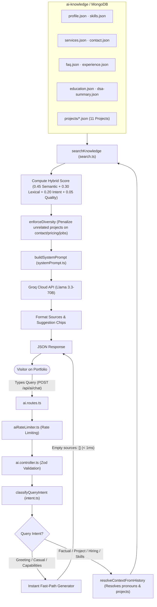

# Portfolio Backend & SKY AI Assistant Service

[](https://nodejs.org/)
[](https://www.typescriptlang.org/)
[](https://expressjs.com/)
[](https://www.mongodb.com/atlas)
[](https://groq.com/)
[](https://render.com)
[](https://vitest.dev/)

The backend microservice for Akash Kumar's portfolio, hosting the **SKY AI RAG (Retrieval-Augmented Generation) Conversational Assistant**, contact enquiry validation, MongoDB Atlas persistence, and Resend email notifications.

---

## Table of Contents

- [Architecture & Tech Stack](#architecture--tech-stack)
- [How SKY AI (RAG Chatbot) Works](#how-sky-ai-rag-chatbot-works)
- [Chatbot Flowchart](#chatbot-flowchart)
- [Complete File-by-File Guide & Roles](#complete-file-by-file-guide--roles)
- [Structured Knowledge Base (`ai-knowledge/`)](#structured-knowledge-base-ai-knowledge)
- [API Endpoint Specifications](#api-endpoint-specifications)
- [Environment Variables](#environment-variables)
- [Local Setup & Development](#local-setup--development)
- [Automated Testing Suite (109 Tests)](#automated-testing-suite-109-tests)
- [MongoDB Atlas Setup Guide](#mongodb-atlas-setup-guide)
- [Resend Email Setup](#resend-email-setup)
- [Render Deployment Guide](#render-deployment-guide)

---

## Architecture & Tech Stack

### Core Runtime & Framework
- **Runtime**: Node.js (>= 20) with native ECMAScript Modules (`"type": "module"`)
- **Language**: TypeScript with strict typing (`NodeNext` module resolution)
- **Web Framework**: Express 5
- **Database & ODM**: MongoDB Atlas with Mongoose
- **Validation**: Zod schema validation for strict payload validation

### AI & RAG Engine
- **LLM Provider**: Groq Cloud LPUs executing **`llama-3.3-70b-versatile`** via an OpenAI-compatible API interface.
- **Intent Classifier**: Zero-latency deterministic engine classifying 22 distinct intent categories (`intent.ts`).
- **Context Resolution Engine**: Inspects multi-turn conversation history to resolve pronouns (*"he"*, *"it"*, *"similar"*) and bind active project slugs (*RapidCare*, etc.).
- **Hybrid Retrieval System**: Combines vector cosine similarity with lexical keyword matching, category intent affinity, and diversity post-processing (`search.ts`).
- **Offline / Test Synthesizer**: Fully deterministic fallback synthesizer enabling zero-cost offline development and sub-second automated testing (`generate.ts`).

### Communications & Security
- **Email Service**: Resend HTTP API for automated contact notifications.
- **Security & Headers**: Helmet for secure HTTP headers, strict CORS whitelisting (`FRONTEND_ORIGINS`), and per-IP rate limiting (`express-rate-limit`).

---

## How SKY AI (RAG Chatbot) Works

Rather than relying on a raw LLM that lacks knowledge of Akash's projects and personal details, **SKY AI uses Retrieval-Augmented Generation (RAG)**:

1. **Deterministic Intent Classification**:
   - The user query is normalized and scanned for 22 intent categories (`greeting`, `casual`, `capabilities`, `profile`, `skills`, `experience`, `education`, `services`, `hiring`, `job`, `internship`, `freelance`, `pricing`, `contact`, `project`, `technology`, `general`, `faq`, `availability`, `resume`, `dsa`, `mixed`).
   - **Instant Fast-Path**: Greetings and capabilities requests bypass vector search completely and return in `< 1ms` with empty sources (`sources: []`).

2. **Multi-Turn Context Resolution**:
   - Follow-up questions like *"What technologies did he use?"* or *"Can Akash build something similar?"* inspect prior conversation turns to carry over the active project slug (e.g., `rapidcare`).

3. **Hybrid Retrieval Scoring**:
   - Verified chunks from the knowledge base are scored using a weighted hybrid formula:
     $$\text{finalScore} = 0.45 \cdot \text{semantic} + 0.30 \cdot \text{lexical} + 0.20 \cdot \text{intentAffinity} + 0.05 \cdot \text{quality}$$
   - **Diversity & Penalty Filter**: Pure contact, job, internship, or pricing queries strictly suppress project chunks so random project files (e.g. *Modplint Interiors*) never displace contact info.

4. **Grounded Prompt Assembly**:
   - The system prompt enforces a natural, conversational tone that answers the user's question in the first sentence, eliminates robotic phrases (*"According to retrieved documents"*), and handles pricing transparently without hallucinating rates.

5. **LLM Generation & Delivery**:
   - The assembled context is streamed through Groq's high-speed LPU infrastructure, formatted with verified source citations and clickable follow-up suggestions, and returned to the client.

---

## Chatbot Flowchart



---

## Complete File-by-File Guide & Roles

```
portfolio-backend/
├── ai-knowledge/                         # Ground-truth structured knowledge base
│   ├── profile.json                      # Akash's background, bio, location, philosophy
│   ├── skills.json                       # Categorized technical competencies & tools
│   ├── services.json                     # Client deliverables, services, and engagement steps
│   ├── contact.json                      # Direct channels (email, LinkedIn, GitHub, response times)
│   ├── faq.json                          # Frequently asked questions for recruiters and clients
│   ├── experience.json                   # Work history, roles, and software accomplishments
│   ├── education.json                    # B.Tech in CSE (RTU, GIT, Jaipur), coursework, CGPA
│   ├── dsa-summary.json                  # Data structures & algorithms problem-solving metrics
│   └── projects/                         # 11 In-depth project dossiers
│       ├── rapidcare.json                # AI healthcare triage & ambulance dispatch platform
│       ├── modplint-interiors.json       # Commercial interior design web platform
│       ├── mern-docs.json                # Developer documentation platform
│       ├── devsync.json                  # Real-time developer collaboration system
│       ├── student-management.json       # Enterprise university ERP & student portal
│       ├── netflix-clone.json            # Streaming service frontend clone with TMDB
│       ├── weather-app.json              # Dynamic meteorological weather application
│       ├── task-manager.json             # Kanban task orchestration system
│       ├── portfolio-v1.json             # Early portfolio iteration
│       ├── e-commerce-store.json         # Full-stack e-commerce catalog & cart
│       └── premier.json                  # Industrial client showcase
├── src/
│   ├── ai/
│   │   ├── llm/
│   │   │   └── generate.ts               # Groq LLM client, fast-path generator & fallback synthesizer
│   │   ├── prompts/
│   │   │   └── systemPrompt.ts           # Natural persona prompt & strict grounding guardrails
│   │   ├── rag/
│   │   │   ├── chunker.ts                # Deterministic semantic chunking & canonical source typing
│   │   │   ├── ingest.ts                 # Knowledge chunk ingestion & MongoDB index upserting
│   │   │   └── index.ts                  # Module exports
│   │   └── retrieval/
│   │       ├── intent.ts                 # 22-category intent classifier & history context resolver
│   │       └── search.ts                 # Hybrid vector/lexical retrieval & diversity enforcement
│   ├── config/
│   │   ├── database.ts                   # Mongoose connection management with auto-reconnect
│   │   ├── env.ts                        # Type-safe environment variable parsing & validation
│   │   └── resend.ts                     # Resend email client configuration
│   ├── controllers/
│   │   ├── ai.controller.ts              # Handlers for /api/ai/chat and /api/ai/lead
│   │   └── contact.controller.ts         # Handlers for /api/contact
│   ├── middleware/
│   │   ├── aiRateLimiter.ts              # IP-based rate limiting for AI endpoints
│   │   ├── errorHandler.ts               # Global error handler with development/production stack traces
│   │   ├── notFoundHandler.ts            # Standardized 404 JSON response
│   │   └── rateLimiter.ts                # IP-based rate limiting for contact submissions
│   ├── models/
│   │   ├── contactEnquiry.model.ts       # Mongoose model for client contact submissions
│   │   ├── conversation.model.ts         # Mongoose model for chat history & sessions
│   │   └── knowledgeChunk.model.ts       # Mongoose model for vector-searchable knowledge chunks
│   ├── routes/
│   │   ├── ai.routes.ts                  # Routes for /api/ai/chat and /api/ai/lead
│   │   ├── contact.route.ts              # Routes for /api/contact
│   │   └── health.route.ts               # Routes for /health and /api/health
│   ├── schemas/
│   │   ├── ai.schema.ts                  # Zod validation schemas for AI chat & lead payloads
│   │   └── contact.schema.ts             # Zod validation schemas for contact submissions
│   ├── services/
│   │   └── email.service.ts              # Resend email notification service
│   ├── app.ts                            # Express application setup, security middleware, and routes
│   └── server.ts                         # Server entry point (starts HTTP listener and DB connection)
├── tests/
│   ├── ai.test.ts                        # 94 AI tests: chunkers, 22 intents, 30 queries, 5 conversations
│   ├── contact.test.ts                   # 12 Contact API tests (validation, persistence, rate limiting)
│   └── email.service.test.ts             # 3 Resend email service unit tests
├── index.js                              # Root launcher delegating to dist/server.js for Render
├── tsconfig.json                         # TypeScript configuration (NodeNext, strict, ES2022)
└── package.json                          # Dependencies, scripts, and engine specifications
```

---

## Structured Knowledge Base (`ai-knowledge/`)

The assistant draws verified facts from structured JSON documents located in [`ai-knowledge/`](file:///c:/Users/akash/Desktop/Website_References/portfolio-backend/ai-knowledge):

| File | Content Covered | Primary Chunks Generated |
| :--- | :--- | :--- |
| `profile.json` | Akash's identity, full-stack title, location, background, philosophy | Profile Overview, Philosophy |
| `skills.json` | Frontend, Backend, 3D/Creative, Database, DevOps, and AI competencies | Skills Matrix, Core Technologies |
| `services.json` | Web applications, 3D interactive, AI integrations, UI modernization | Services Overview, Engagement Steps |
| `contact.json` | Email, LinkedIn, GitHub, response times, inquiry guidelines | Direct Contact Channels |
| `faq.json` | Work availability, remote preferences, hiring process, pricing scoping | Frequently Asked Questions |
| `experience.json` | Production track record, open-source work, architectural highlights | Professional Experience |
| `education.json` | B.Tech in CSE (RTU, GIT, Jaipur), academic coursework, core subjects | Education Background |
| `dsa-summary.json` | Data Structures & Algorithms problem-solving metrics (LeetCode, C++) | Algorithmic Problem Solving |
| `projects/*.json` | 11 Project dossiers (RapidCare, Modplint, MERN Docs, etc.) | Overview, Architecture, Tech Stack |

---

## API Endpoint Specifications

### 1. AI Chat Assistant
- **Method**: `POST /api/ai/chat`
- **Rate Limit**: 20 requests per minute per IP.
- **Request Body**:
  ```json
  {
    "message": "What technologies were used in RapidCare?",
    "conversationId": "sky_1720000000_abcde",
    "history": [
      { "role": "user", "content": "Tell me about RapidCare." },
      { "role": "assistant", "content": "RapidCare is an AI-driven healthcare platform..." }
    ]
  }
  ```
- **Response (`200 OK`)**:
  ```json
  {
    "success": true,
    "answer": "RapidCare was built with React, Node.js, Express, MongoDB, Socket.IO for real-time dispatch, and Groq AI for clinical triage.",
    "sources": [
      {
        "chunkId": "project:rapidcare:tech",
        "title": "RapidCare - Technologies & Architecture",
        "type": "project",
        "projectSlug": "rapidcare",
        "url": "https://rapidcare.vercel.app"
      }
    ],
    "suggestedQuestions": [
      "Can Akash build something similar?",
      "What is Akash's tech stack?",
      "How do I hire Akash?"
    ],
    "conversationId": "sky_1720000000_abcde"
  }
  ```

### 2. AI Lead Capture
- **Method**: `POST /api/ai/lead`
- **Purpose**: Directly persists client contact enquiries initiated from the AI chatbot and triggers an inbox alert via Resend.
- **Payload & Behavior**: Shares identical validation and persistence rules with `POST /api/contact`.

### 3. Contact Form Submission
- **Method**: `POST /api/contact`
- **Rate Limit**: 5 submissions per 15 minutes per IP.
- **Request Body**:
  ```json
  {
    "name": "Jane Doe",
    "email": "jane@company.com",
    "service": "Full-Stack Web Development",
    "message": "We would like to hire Akash for a custom web application."
  }
  ```
- **Response (`201 Created`)**:
  ```json
  {
    "success": true,
    "message": "Message received successfully! I will reply shortly."
  }
  ```

### 4. Health Check
- **Method**: `GET /health` (or `GET /api/health`)
- **Response (`200 OK`)**:
  ```json
  {
    "status": "healthy",
    "service": "portfolio-backend",
    "timestamp": "2026-10-01T22:00:00.000Z",
    "uptime": 1420
  }
  ```

---

## Environment Variables

Create `.env` in `portfolio-backend`:

```bash
# Server & Port
PORT=5000
NODE_ENV=development

# Database Connection
MONGODB_URI=mongodb+srv://<username>:<password>@cluster0.mongodb.net/portfolio?retryWrites=true&w=majority

# CORS Allowed Origins (Comma-separated)
FRONTEND_ORIGINS=http://localhost:5173,https://skykumar.vercel.app

# Resend Email Configuration
RESEND_API_KEY=re_your_api_key_here
CONTACT_EMAIL=akashkumarhzb121@gmail.com

# Groq LLM Configuration (OpenAI-compatible)
AI_API_KEY=gsk_your_groq_api_key_here
AI_MODEL=llama-3.3-70b-versatile
AI_BASE_URL=https://api.groq.com/openai/v1
```

---

## Local Setup & Development

### 1. Install Dependencies
```bash
cd portfolio-backend
npm install
```

### 2. Run Development Server
```bash
npm run dev
```
Starts the server with `tsx watch` for instant hot-reload on TypeScript changes.

### 3. Run Production Build
```bash
npm run build
```
Compiles TypeScript cleanly into the `dist/` directory.

### 4. Start Production Server
```bash
npm start
```
Executes `node dist/server.js`.

---

## Automated Testing Suite (109 Tests)

The backend features a comprehensive test suite in Vitest testing all routes, edge cases, vector search, chunkers, intent classification, and multi-turn conversations:

```bash
npm test
```

### Test Coverage Highlights:
- **`tests/email.service.test.ts` (3 tests)**: Resend API dispatch, timeout handling, and connection error handling.
- **`tests/contact.test.ts` (12 tests)**: Zod validation, rate limits, MongoDB persistence, and error handling.
- **`tests/ai.test.ts` (94 tests)**:
  - Chunker validation for all 9 data types.
  - Classification for **all 22 intent categories**.
  - Verification of **the 15 Golden Retrieval Ranking Cases** (confirming 0 projects returned for pure contact/pricing/jobs).
  - Verification of **all 30 single-turn queries** from Section 27.
  - Multi-turn state persistence across **5 conversational flows** (TEST A through TEST E).

---

## MongoDB Atlas Setup Guide

1. Log in to [MongoDB Atlas](https://cloud.mongodb.com/).
2. Create a free cluster (e.g. M0 Sandbox).
3. Under **Database Access**, create a user with read/write privileges to the `portfolio` database.
4. Under **Network Access**, add `0.0.0.0/0` (Render allocates dynamic outbound IPs).
5. Copy your connection string into `MONGODB_URI` in `.env`.

---

## Resend Email Setup

1. Create a free API key at [Resend](https://resend.com/api-keys).
2. Set `RESEND_API_KEY` in your environment.
3. Configure `CONTACT_EMAIL` with your personal email address.
4. Until you verify a custom domain, notifications originate from `onboarding@resend.dev`.

---

## Render Deployment Guide

1. Create a new **Web Service** on [Render](https://dashboard.render.com/).
2. Connect your GitHub repository and set:
   - **Root Directory**: `portfolio-backend`
   - **Environment**: `Node`
   - **Branch**: `main`
   - **Build Command**: `npm ci --include=dev && npm run build`
   - **Start Command**: `npm start`
3. Under **Health Check Path**, enter `/health`.
4. Add all required **Environment Variables** (`NODE_ENV`, `MONGODB_URI`, `FRONTEND_ORIGINS`, `RESEND_API_KEY`, `CONTACT_EMAIL`, `AI_API_KEY`, `AI_MODEL`, `AI_BASE_URL`).
5. Trigger deployment. Verify deployment status by visiting `https://your-service.onrender.com/health`.
