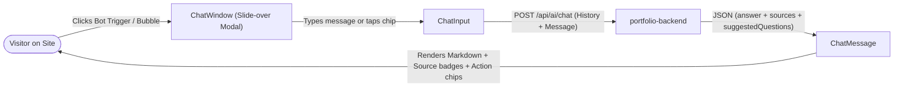

# Akash Kumar · Creative Portfolio & Digital Experience

[](https://react.dev/)
[](https://www.typescriptlang.org/)
[](https://vitejs.dev/)
[](https://tailwindcss.com/)
[](https://threejs.org/)
[](https://vercel.com/)
[](LICENSE)

An editorial, high-performance developer portfolio showcasing creative frontend craft, interactive 3D WebGL physics, and a full-stack **SKY AI** conversational assistant. Built with **React 19**, **TypeScript**, **Three.js**, **OGL**, **Rapier Physics**, **GSAP**, **Lenis**, and **Tailwind CSS v4**.

---

## Table of Contents

- [Overview & Experience](#overview--experience)
- [Key Interactive Features](#key-interactive-features)
- [SKY AI Chatbot Widget](#sky-ai-chatbot-widget)
- [Technology Stack & Roles](#technology-stack--roles)
- [Project Architecture & File-by-File Guide](#project-architecture--file-by-file-guide)
- [Featured Projects](#featured-projects)
- [Animation & Scroll Synchronization](#animation--scroll-synchronization)
- [Getting Started](#getting-started)
- [Environment Variables](#environment-variables)
- [Vercel Deployment Guide](#vercel-deployment-guide)
- [Performance & Accessibility](#performance--accessibility)
- [Author & Contact](#author--contact)

---

## Overview & Experience

This portfolio bridges the gap between expressive creative engineering and robust software architecture:
- **Kinetic & Atmospheric Motion**: Thoughtful micro-interactions, responsive physics, and 60fps canvas animations.
- **Continuous Master Grid**: Seamless, mathematically aligned 24px dark grid coordinate system extending unbroken across the entire site.
- **Synchronized Scroll Engine**: Hardware-accelerated smooth scrolling using Lenis frame-locked into the GSAP ticker with scroll-isolation styling.
- **Embedded AI Assistant (SKY AI)**: An intelligent portfolio concierge that answers visitor inquiries about Akash's skills, projects, background, and hiring availability in real time.

---

## Key Interactive Features

### 1. Spaceship Cockpit Viewport & Hyperspace (`Hero.tsx`)
- Hyperspace lightspeed starfield simulation streaming past the screen (`Lightspeed.tsx`).
- Sci-fi spaceship canopy windshield frame featuring chamfered tech corner brackets, visor LEDs, diagonal glass glare, cockpit telemetry HUD, and a central flight vector crosshair reticle (`SpaceshipCockpitFrame.tsx`).
- Particle-based interactive headline typography on "Akash Kumar" (`ParticleText.tsx`).

### 2. 3D Text Reveal (`TextReveal3D.tsx`)
- 3D perspective typography reveal using GSAP and `IntersectionObserver`.
- Words rotate into position across the Z-axis with depth blur easing as the section enters the viewport.

### 3. 3D Curved Cylinder Tech Stack (`TechStack.tsx` & `CircularGallery.tsx`)
- WebGL curved cylinder gallery powered by **OGL**.
- **Idle Auto-Spin**: Gently auto-rotates in idle mode to invite engagement.
- **Scroll-Reactive**: Automatically spins with scroll momentum when scrolling past the section.
- **Interactive Controls**: Header spin buttons (`[ ← Spin Left ]`, `[ Spin Right → ]`), floating side arrow buttons, mobile touch triggers, and drag/wheel support.

### 4. Stay-in-Place Project Card Stacking (`Projects.tsx` & `ScrollStack.tsx`)
- Smooth inertial scrolling orchestrated with **Lenis**.
- Book-style pin stacking where each project card slides up and anchors sequentially without bouncing, shaking, or jitter.

### 5. Interactive 3D Physics Lanyard Card (`About.tsx` & `Lanyard.tsx`)
- Real-time 3D identity badge powered by **Three.js**, **React Three Fiber**, and **Rapier Physics**.
- Draggable with spring physics, realistic gravity, collision boundaries, and customized lanyard cord kinematics.
- Optimized with `frameloop="demand"` to pause GPU rendering when off-screen.

### 6. Capabilities & Accordion Gallery (`Services.tsx`)
- Interactive expanding service accordion with 3D tilt and parallax motion (`AccordionGallery.tsx`).
- SVG curve transitions connecting the dark grid theme and light section without harsh cuts.
- Curved **Bending Marquee** following custom SVG arc coordinates (`BendingMarquee.tsx`).

### 7. Global Screen-Blend Glow Cursor (`GlowCursor.tsx`)
- Custom dual-color pointer aura with smooth latency-free interpolation and screen-blended lighting.

---

## SKY AI Chatbot Widget

The frontend includes an interactive, floating AI assistant named **SKY AI** ([`src/components/ai/Chatbot.tsx`](file:///c:/Users/akash/Desktop/Website_References/portfolio-frontend/src/components/ai/Chatbot.tsx)), communicating with the backend RAG engine.



### Key Chatbot Capabilities
- **Floating HUD Trigger**: Bottom-right floating action button with ambient pulse effects, unread notification indicator, and quick-open shortcut.
- **Slide-Over Chat Window ([`ChatWindow.tsx`](file:///c:/Users/akash/Desktop/Website_References/portfolio-frontend/src/components/ai/ChatWindow.tsx))**: Responsive drawer on mobile, floating card on desktop with light dismiss (outside click and `Escape` key support).
- **Rich Message Rendering ([`ChatMessage.tsx`](file:///c:/Users/akash/Desktop/Website_References/portfolio-frontend/src/components/ai/ChatMessage.tsx))**:
  - Full Markdown formatting (bolding, lists, code snippets).
  - Interactive **Source Badges** citing verified portfolio chunks with direct links to live demos or GitHub repositories.
  - Interactive **Action Chips** for lead generation (*"Send a Proposal"*, *"Schedule Call"*, *"Copy Email"*).
- **Suggested Follow-up Questions ([`SuggestedQuestions.tsx`](file:///c:/Users/akash/Desktop/Website_References/portfolio-frontend/src/components/ai/SuggestedQuestions.tsx))**: Dynamic topic chips that allow visitors to explore projects, skills, or hiring workflows with a single tap.
- **Direct Lead Capture**: Visitors can express hiring intent directly within the chat, which bridges to the backend enquiry and email notification pipeline.

---

## Technology Stack & Roles

| Technology | Category | Purpose in Project |
| :--- | :--- | :--- |
| **React 19** | UI Framework | Component architecture, state management, and modern concurrent rendering. |
| **TypeScript 6** | Language | End-to-end type safety, strict interface contracts, and autocompletion. |
| **Vite 8** | Build Tool | Lightning-fast HMR (Hot Module Replacement) and optimized production rollups. |
| **Tailwind CSS v4** | Styling | Modern CSS styling using the new `@tailwindcss/vite` engine and CSS variables. |
| **Three.js** | 3D Graphics | WebGL rendering engine for 3D physics badge, mesh geometry, and lighting. |
| **@react-three/fiber** | React 3D | Declarative React wrapper for Three.js scene graphs and cameras. |
| **@react-three/drei** | 3D Utilities | Pre-built helpers for GLTF model loading, textures, and canvas environments. |
| **@react-three/rapier** | Real-Time Physics | Physics simulation (rigid bodies, joints, gravity, collisions) for the lanyard badge. |
| **OGL** | Lightweight WebGL | High-performance WebGL library driving the 3D curved cylinder tech gallery. |
| **GSAP (GreenSock)** | Motion & Timelines | Complex 3D transforms, timeline scrubs, and 3D matrix typography reveals. |
| **Motion (Framer Motion v13)**| React Animation | Micro-interactions, spring animations, modal transitions, and accordion reveals. |
| **Lenis** | Smooth Scroll | Hardware-accelerated inertial scrolling frame-locked with GSAP ticker. |
| **React Hook Form & Zod** | Forms & Validation | Fast, unmanaged form handling with strict schema validation. |
| **Sonner** | Feedback UI | Polished toast notifications for contact submissions and clipboard actions. |
| **Lucide React** | Icons | Modern, lightweight SVG iconography. |

---

## Project Architecture & File-by-File Guide

```
portfolio-frontend/
├── public/
│   ├── favicon.svg                       # Portfolio icon
│   ├── images/
│   │   ├── profile/                      # Headshots, avatars, and bio photos
│   │   ├── projects/                     # High-resolution project mockups & banners
│   │   └── tech/                         # Full-stack technology icons
│   ├── models/
│   │   └── card.glb                      # 3D GLTF identity card for Rapier physics
│   └── resume/
│       └── AKASH_KUMAR_RESUME.pdf        # Downloadable PDF resume
├── src/
│   ├── components/
│   │   ├── ai/                           # SKY AI Assistant UI components
│   │   │   ├── Chatbot.tsx               # Master AI trigger, drawer toggle & endpoint resolver
│   │   │   ├── ChatWindow.tsx            # Chat container, message list, header & quick actions
│   │   │   ├── ChatMessage.tsx           # Markdown message bubble, source badges & copy button
│   │   │   ├── ChatInput.tsx             # Text input, send button, and keyboard shortcuts
│   │   │   └── SuggestedQuestions.tsx    # Clickable suggestion chips
│   │   ├── effects/                      # Creative WebGL & kinetic motion components
│   │   │   ├── AccordionGallery.tsx      # Parallax service accordion cards
│   │   │   ├── BendingMarquee.tsx        # Curved text marquee following SVG paths
│   │   │   ├── CircularGallery.tsx       # 3D OGL cylinder tech stack carousel
│   │   │   ├── GlowCursor.tsx            # Screen-blended cursor lighting trail
│   │   │   ├── Lanyard.tsx               # Rapier 3D physics badge with demand rendering
│   │   │   ├── Lightspeed.tsx            # Hyperspace starfield particle simulation
│   │   │   ├── ParticleText.tsx          # Canvas particle physics on headline text
│   │   │   ├── ScrollStack.tsx           # Book-style stacking project cards
│   │   │   ├── SpaceshipCockpitFrame.tsx # Sci-fi cockpit canopy HUD & flight reticle
│   │   │   ├── TextReveal3D.tsx          # GSAP 3D depth-rotated text reveal
│   │   │   └── TextScatter.tsx           # Kinetic hover scatter typography
│   │   ├── layout/
│   │   │   ├── Header.tsx                # Floating navigation bar with glassmorphic backdrop
│   │   │   └── Footer.tsx                # Terminal-styled footer with status beacon & socials
│   │   ├── sections/                     # Semantic page sections
│   │   │   ├── Hero.tsx                  # Space cockpit, title, CTA, and telemetry
│   │   │   ├── TechStack.tsx             # Interactive 3D OGL circular tech showcase
│   │   │   ├── Projects.tsx              # Featured project cards with Lenis stack pins
│   │   │   ├── Services.tsx              # Service deliverables & capability cards
│   │   │   ├── About.tsx                 # Bio, interactive 3D physics card, and journey
│   │   │   └── Contact.tsx               # Zod-validated enquiry form & direct social links
│   │   └── ui/                           # Reusable UI primitives (Buttons, Badges, Tooltips)
│   ├── data/
│   │   ├── projects.ts                   # Featured projects data & metadata
│   │   ├── skills.ts                     # Categorized tech stack definitions & icons
│   │   └── services.ts                   # Service packages and deliverables
│   ├── styles/
│   │   └── globals.css                   # Tailwind v4 directives, custom scrollbars, grid tokens
│   ├── App.tsx                           # Master application shell with Lenis-GSAP synchronization
│   └── main.tsx                          # React 19 root entry with strict mode
├── vercel.json                           # Vercel SPA routing rewrites & immutable caching
├── vite.config.ts                        # Vite build configuration & path aliases
└── package.json                          # Dependencies & build scripts
```

---

## Featured Projects

1. **RapidCare** (`HEALTHTECH · AI-POWERED CARE CONTINUITY`):
   - AI-driven clinical triage & emergency dispatch network with real-time Socket.IO ambulance tracking, automated bed reservation, and offline-first health record sync.
2. **Modplint Interiors** (`COMMERCIAL · INTERIOR DESIGN PLATFORM`):
   - Production commercial interior design web platform with real-time consultation booking, Cloudinary media gallery, and MongoDB Atlas persistence.
3. **MERN Docs** (`PRODUCTIVITY · DEVELOPER DOCUMENTATION`):
   - Full-stack developer documentation portal featuring versioned markdown documentation, live code snippets, and interactive search.
4. **Student Management System** (`COLLEGE ERP · FULL-STACK PLATFORM`):
   - Enterprise student portal with role-based access control (Admin, Faculty, Student), grade tracking, and academic analytics.
5. **3D Interactive Portfolio** (`CREATIVE ENGINEERING`):
   - This site — featuring WebGL shaders, Three.js Rapier physics, OGL 3D cylinder, and Lenis smooth scrolling.

---

## Animation & Scroll Synchronization

To eliminate scroll jitter, lag, and competing rendering loops, three critical performance optimizations are implemented:

1. **GSAP Ticker Lock ([`src/App.tsx`](file:///c:/Users/akash/Desktop/Website_References/portfolio-frontend/src/App.tsx))**:
   - Lenis scroll updates are wired directly into GSAP's ticker:
     ```ts
     gsap.ticker.add((time) => lenis.raf(time * 1000));
     lenis.on('scroll', ScrollTrigger.update);
     gsap.ticker.lagSmoothing(0); // Prevents frame stuttering during rapid scrolls
     ```
2. **Scroll-Isolation Pointer Lock ([`src/styles/globals.css`](file:///c:/Users/akash/Desktop/Website_References/portfolio-frontend/src/styles/globals.css))**:
   - When the user scrolls actively, `html.lenis-scrolling *, .lenis-scrolling * { pointer-events: none !important; }` disables pointer hit-testing and hover recalculations across all elements, saving valuable CPU cycles.
3. **On-Demand 3D Canvas Rendering ([`src/components/effects/Lanyard.tsx`](file:///c:/Users/akash/Desktop/Website_References/portfolio-frontend/src/components/effects/Lanyard.tsx))**:
   - The Three.js canvas runs with `frameloop="demand"`, which pauses continuous WebGL rendering when the 3D lanyard is stationary or out of view.

---

## Getting Started

### Prerequisites
- **Node.js**: v20.0.0 or higher
- **Package Manager**: `npm` (or `pnpm` / `yarn`)

### Installation & Local Run
```bash
# 1. Clone repository
git clone https://github.com/akashkumarhzb121-cloud/Portfolio.git
cd Portfolio/portfolio-frontend

# 2. Install dependencies
npm install

# 3. Start local development server
npm run dev
```
Open `http://localhost:5173` in your browser.

### Available Scripts
| Command | Description |
| :--- | :--- |
| `npm run dev` | Starts Vite local development server with Hot Module Replacement |
| `npm run build` | Runs TypeScript check (`tsc -b`) and builds minified assets to `dist/` |
| `npm run preview` | Locally preview the production build at `http://localhost:4173` |
| `npm run lint` | Runs Oxlint to inspect codebase quality and hook integrity |

---

## Environment Variables

Create `.env.local` in `portfolio-frontend`:

```bash
# Backend Contact Form API endpoint
VITE_CONTACT_FORM_ENDPOINT=https://your-backend.onrender.com/api/contact

# Optional: Explicit AI Chatbot API endpoint (defaults automatically to /api/ai/chat)
VITE_AI_CHAT_ENDPOINT=https://your-backend.onrender.com/api/ai/chat
```

> [!IMPORTANT]
> **Client-Side Security**:
> All `VITE_*` environment variables are compiled into the client-side JavaScript bundle and are visible to anyone inspecting the network tab. **Never** put database connection strings, email private keys, or LLM API keys in the frontend. All AI keys and database credentials reside securely on the backend host.

---

## Vercel Deployment Guide

1. Go to your project on the [Vercel Dashboard](https://vercel.com/dashboard).
2. Configure **Project Settings**:
   - **Root Directory**: `portfolio-frontend`
   - **Framework Preset**: `Vite`
   - **Build Command**: `npm run build`
   - **Output Directory**: `dist`
   - **Install Command**: `npm install`
3. Under **Settings** $\rightarrow$ **Environment Variables**, add:
   - `VITE_CONTACT_FORM_ENDPOINT`: `https://your-backend.onrender.com/api/contact`
4. Trigger a deployment. The site is live with global edge CDN caching.

---

## Performance & Accessibility

- **Optimized 3D Loading**: Models and textures load asynchronously with visual fallback skeletons to eliminate layout shift.
- **Reduced Motion Support**: Animations respect system preferences via `prefers-reduced-motion` media queries.
- **Accessible Semantics**: Semantic HTML5 elements (`<section>`, `<main>`, `<header>`, `<footer>`), ARIA attributes, and accessible keyboard focus states throughout.
- **Cache-Control Headers**: Configured in [`vercel.json`](file:///c:/Users/akash/Desktop/Website_References/portfolio-frontend/vercel.json) for 1-year immutable caching on static assets (`/assets/*`).

---

## Author & Contact

- **Name**: Akash Kumar
- **Role**: Full-Stack Engineer & Creative Frontend Developer
- **Email**: [akashkumarhzb121@gmail.com](mailto:akashkumarhzb121@gmail.com)
- **GitHub**: [github.com/akashkumarhzb121-cloud](https://github.com/akashkumarhzb121-cloud)
- **LinkedIn**: [linkedin.com/in/akash-kumar-488074309](https://www.linkedin.com/in/akash-kumar-488074309)

---

## License

This project is open-source under the [MIT License](LICENSE).
